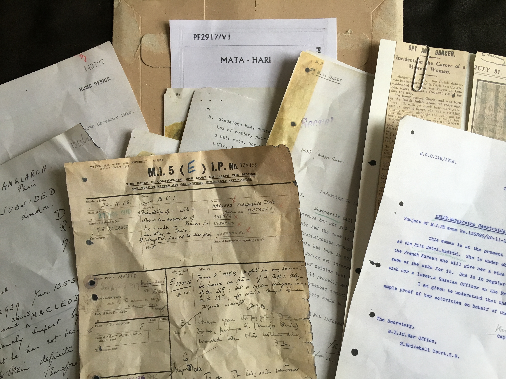
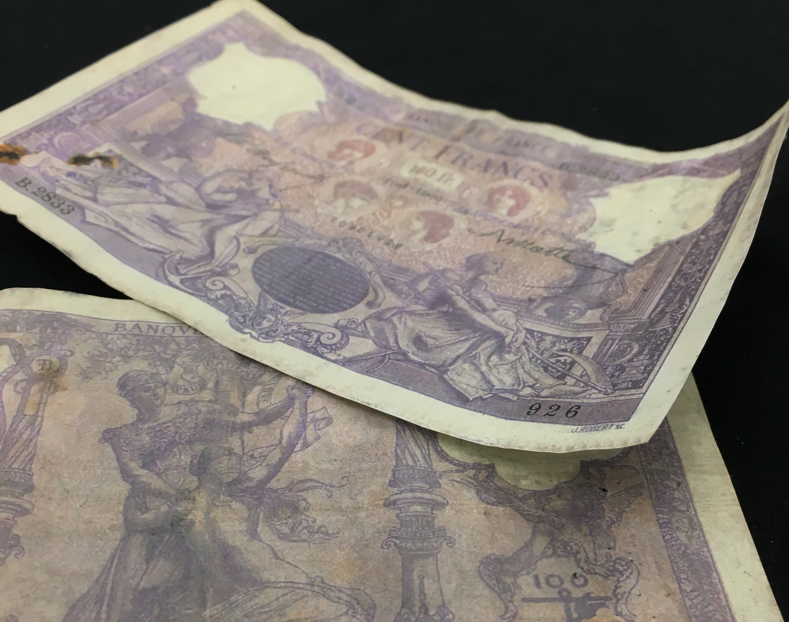
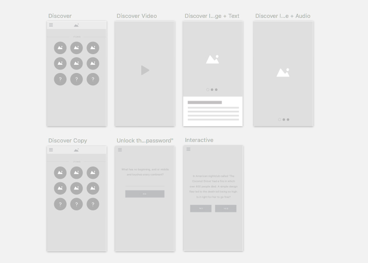
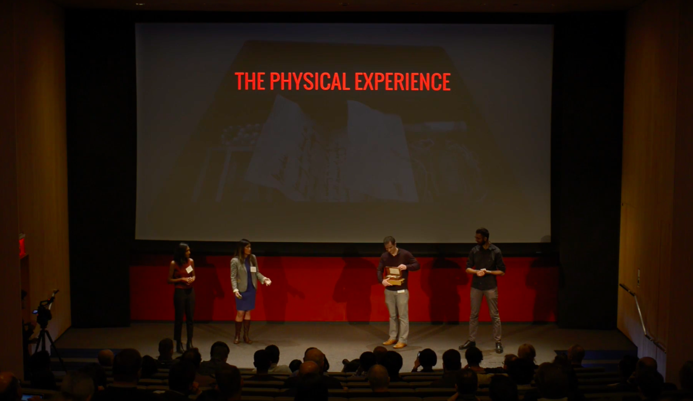
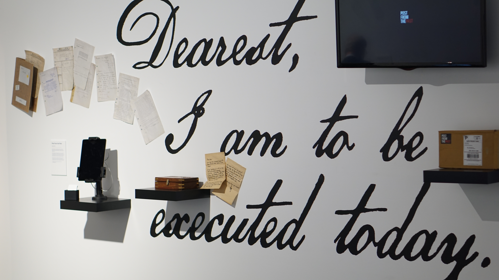

<i>Post from the Past (PFTP)</i> is an immersive in-home experience in which you receive physical packages from historical figures in order to uncover the mystery of their personal story online. Hear their voices, explore artifacts from their life, and search our digital archives to fit together the multi-media puzzle pieces that reveal their story. through an immersive physical and digital journey. PFTP originated during (and won) a design jam for A+E History Channel. It was also a 2016 NYC Media Lab Combine (a pre-accelerator program for tech & media startups) selectee and New Challenge Winner, which provided the structure for <a href="#business">proving out the business</a> and social impact aspects of the project. An <a href="#exhibition">installation</a> showing the user journey was designed for the 2016 MFA Design & Technology thesis show.

<h2 class="project-sub">Challenge</h2>

There is a lack of engagement and meaningful learning of history in pre-college education and a limited number of avenues for continued enrichment post-college graduation. As the humanities continue to lose prestige and resources in the pre-college education system, there is a danger that the knowledge and critical thinking skills developed through rigorous history instruction will be lost in future generations. Furthermore, in many classrooms history is communicated through reading textbooks focusing on “Great White Man History” and the recitation of dates and absolute facts, which do not provide for deeper/connected learning of historical concepts and also do nothing to create connected or enthusiastic lifelong learners.

<h2 class="project-sub">Goal</h2>

Post from the Past seeks to make learning history a more accessible, authentic, and engaging experience. Using game mechanics, we are attempting to mimic and train current and future generations around how to do research - sifting through information, filtering and synthesizing primary and secondary sources, and using critical thinking skills to draw their own informed conclusions about contested historical events. Furthermore, we aim to build a sustainable business that will enable us to advance this social mission.

<h3 class="project-sub-main">Product Design Process</h3>

The development of Post from the Past has been through several stages of product development: design sprint for the A+E History Channel, a 4-month research, business validation, and product development phase with the NYC Media Lab Combine, and our current phase, which involves 3-week design sprints to further develop and test the digital product. In addition to leading the team and serving as the primary product designer/developer for the second phase, I also created an exhibition to promote our product and process for my MFA Design & Technology thesis show.

The minimum viable product was conceived and created in less than 24 hours for the A+E History Channel design jam. Collectively, my three teammates and I brainstormed the basic concept, researched its fit within the existing A+E History Channel product ecosystem, and developed a streamlined user experience. We created a physical product, basic web app UI, and a video to capture the narrative experience.

<h2 class="project-sub">Fabrication & Tech Iterations</h2>

On the product side, I sourced and fabricated all physical components and developed/tested the tech integration. Fabrication involved reproducing artifacts from the historical figure's life and sourcing them when possible in order to balance my production time cost and customizability against the cost and authenticity of sourced objects.

    
    
    
    
    

When testing tech solutions to the audio component of the boxes, I sought to balance sound quality, volume, size, consistency of experience, and cost. I tested capacitive touch sensors, light sensor, touchscreen touch patterns, QR codes, and image recognition as a way to trigger the sound and various speaker sizes and amps for audio output. All of this was also weighed against our user experience goals: complete immersion in the tangible experience, delight/surprise, and guidance for how to understand/explore the items in the box.

After numerous rounds of testing, I ended up finding a middle ground between the different requirements through one of the simplest solutions: a greeting card sound module with light sensor and speaker hidden under a fake bottom of the box so that when a user opens the box, it plays the introductory audio.

<h2 class="project-sub">Content strategy</h2>

Working with another narrative expert, I crafted the entire story told through the objects included in the mailings, accompanying audio script, and web app. This involved in-depth research into the featured historical person and the time, place(s), and people connected to her. In addition to synthesizing this information into lively first-person narration and creative multi-media pieces, I also mapped out the content flow for the web app, so that we could start to understand possible structures for the digital platform. 

<h2 class="project-sub">Digital Product UX</h2>

Working with another UX/UI designer, I created wireframes and developed the latest iteration of UI, integrating the content I created into the final designs for the web app. I incorporated all of these into the prototype for the app (using InVision), and developed the first iteration of the web app after a round of user testing and design revisions.

As a result of user testing, in recent months, our team has pivoted our digital product to more closely mirror the physical experience of exploration and to put more emphasis on a game-like experience. In its most recent iteration, the digital component focuses on uncovering pieces of the historical figure's story by searching keywords and unlocking lines on a crucial redacted file.

<h2 class="project-sub">User Testing</h2>

For each iteration of the physical and digital product, we conducted user testing, putting the product in front of our target users and observing and getting feedback, before synthesizing and incorporating our findings into the next iteration of the product. This was particularly useful for understanding how open-ended or directed the experience should be.

    
    
    
    

For example, in early testing we found that users needed a clearer path from the physical to digital experience, so we incorporated a postcard from an imaginary “Archivist” that articulated a clear direction/action for the user: <i>Who sent this? Are they guilty? You may find the missing pieces at www.postfromthepast.net</i>.

<h3 class="project-sub-main" id="business">Business Validation</h3>

<h2 class="project-sub">Research & Customer Segmentation</h2>

During the course of the Combine program, my team and I conducted over 120 interviews to determine audience fit and user experience. For the customer segment interviews, we asked broad questions about behavior patterns (e.g., As a history enthusiast, how do you consume history now? What’s your historical guilty pleasure?) and honed in on specifics within their self-identified interest (e.g. As a museum educator, what type of objects do your students find the most interesting? What are challenges to teaching with objects?).

We reached out to and interviewed self-identified history enthusiasts (ranging from historical reenactors to long-time biography readers), museum staff, educators (school administrators and teachers), game enthusiasts/designers, subscription box customers, and parents. This process proved many of our hypotheses about these groups, but there were some surprises about our assumptions as well.

Here's a video summarizing our journey and some high level findings:

<iframe width="640" height="360" src="https://www.youtube.com/embed/-YhTu8hyqxQ" frameborder="0" allowfullscreen></iframe>

From these interviews we established that our target customer was a relatively settled adult who is looking for new and more interactive ways to consume topics of interest (that they do not necessarily associate with "hardcore history"). This ideal consumer might also have a child with who they want to share their love to learning and think of PFTP as a way to spend quality time together.

<h2 class="project-sub">Business Planning</h2>

Basing our business validation process in lean startup methodology, we calculated market sizing, explored existing box subscription competitors, created models for sourcing and channel distribution, and figured out the economics of product/marketing cost versus revenue at various price points.

    
    
    
    

Our pitch, which included business validation and product development during the Combine, was presented to major NYC media companies, VCs, and other investors at the NYC Media Lab Combine Demo Day.

<h3 class="project-sub-main" id="exhibition">Exhibition Design Process</h3>

In order to present the initial body of work done on Post from the Past, I also designed and implemented an exhibition design that allowed visitors to see the user journey laid out in physical space.

    
    
    
    

A first iteration was mapped out in the physical space and a second round of exhibition designs were sketched out and then modeled in Illustrator in order to get approval for installation.

I did all of the fabrication and construction for the physical installation. Here's a peek into the final uncovering of the stenciled large script words that served to ground the piece:

<iframe width="640" height="360" src="https://www.youtube.com/embed/y-R2fNMAUrc" frameborder="0" allowfullscreen></iframe>

