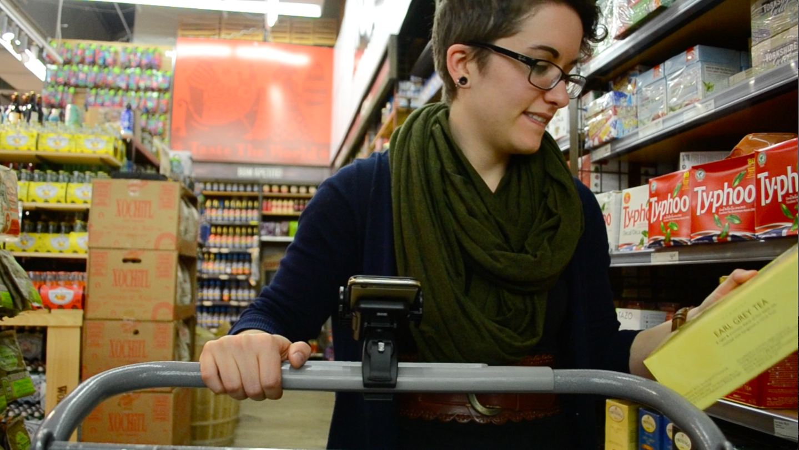
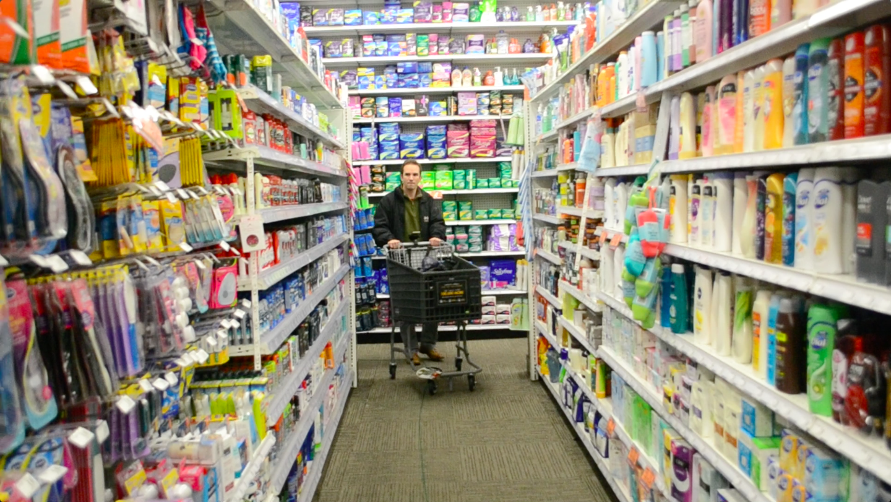
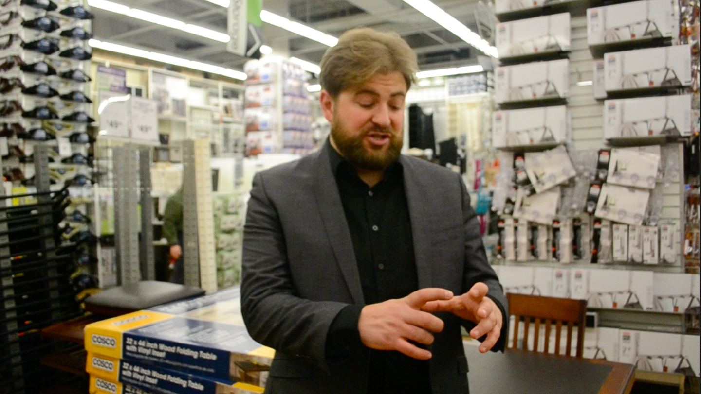
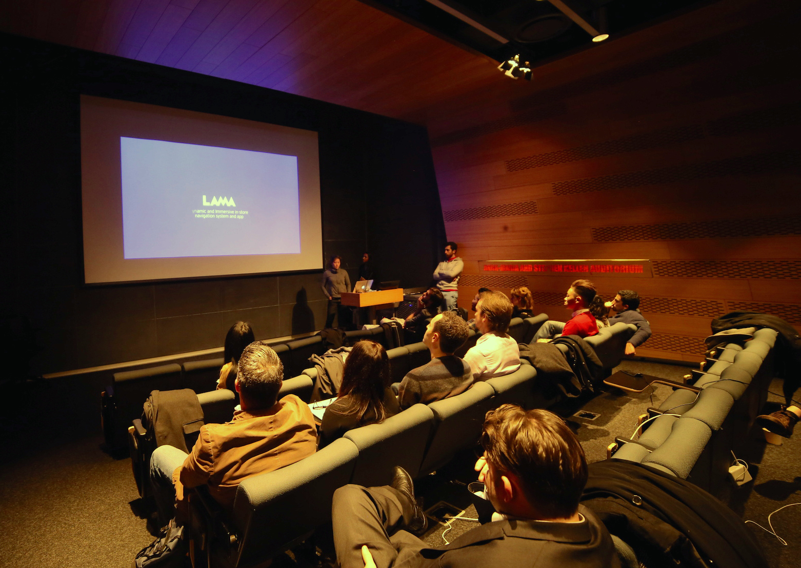

<i>LAMA</i> was developed for the Publicis Groupe "Retail Experience of the Future" NYC Media Lab Corporate Challenge.

The basic concept is an app that stores users' shopping lists so that when they visit a big box store, the app can automatically route them on the most efficient path to shop for their items, dynamically changing their path as the customer adds items to their Smart Cart or list. Because items are being check off as they are added to the Smart Cart, users can checkout at any time using the app on their phone.

For flagship stores, navigation data could be reflected in a light installation on the ceiling of the store adding visual interest to an otherwise mundane shopping process. Retailers also benefit by being able to add location-/user-specific ads, receive the data from consumer product choices, and understand overall store traffic patterns.

<h2 class="project-sub">Challenge</h2>

E-commerce is draining sales from brick and mortar stores. It is convenient and helps consumers avoid the stress of navigating a store and the time suck of waiting in line for checkout. However, there are some definite reasons why customers still sometimes chose to shop in-store - the experience of browsing, the ability to see and touch physical products, and the necessity of acquiring a product immediately to name a few. Looking to the future of retail, how might the in-store shopping experience be improved by our learning from e-commerce platforms?

<h2 class="project-sub">Goal</h2>

Our goal was to form a coherent and innovative solution to the problems facing in-store retail and to pitch a concept that had been tested with users and proven from a technical perspective in a relatively quick timeframe. Our solution, LAMA, not only addresses the pain points for brick and mortar customer experience at a "big box store" by incorporating successful aspects of e-commerce platforms, but also incorporates features that provide additional value for the retailer.

<h3 class="project-sub-main">Design Process</h3>

Our process for developing LAMA involved four major stages: research and synthesis of existing trends and new technology, ideation, rapid prototyping, quick user testing in the physical space, and refining the concept and interactions.

<h2 class="project-sub">Research</h2>

Our team of three, guided by designer Bernardo Schorr (Smart Design), developed LAMA by first researching examples of innovative thinking in retail and interactive spaces. We synthesized over 40 examples to identify overarching trends and analyzed what about these were successful and why.

<h2 class="project-sub">Digital Design</h2>

Once we brainstormed a concept, I led the development of a holistic user journey through the physical and digital space and developed the pitch narrative. Working with another UX/UI designer, I created the final consumer-facing screen designs and made the interactive prototype in InVision.

<h2 class="project-sub">User Testing</h2>

Over a week's time, the team conducted two rounds of in-depth user testing on-site at a “big box store” with four participants. In order to get a sense of the physical aspects of the concept, we used yarn to simulate the lighted path to items on the consumer’s list.

In parallel to our user testing and proving out the product concept, our software developer on the project built technical mockups to test the feasibility of multiple user pathways via a custom algorithm. The final concept was presented to executives and staff of Publicis Groupe subsidiaries.

