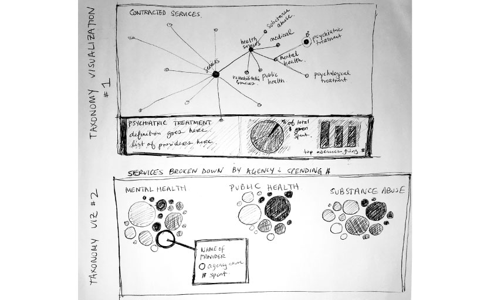

These web-based, interactive data visualizations were created for the NYC Mayor's Office to visualize data from their <a href="http://www1.nyc.gov/site/hhsaccelerator/index.page">HHS Accelerator</a>. The visualizations were built using HTML/CSS, JavaScript, D3.js, and the JavaScript InfoVis Toolkit.

During my 2015 summer internship with the NYC Mayor’s Office, I worked to fulfill the design and data visualization needs in the Office of Operations, which is responsible for running and evaluating HHS Accelerator. HHS Accelerator is an online-system designed to improve the City's contracting process by consolidating access to the city's funding opportunities (across departments) and providing financial transaction capabilities.

My particular goal was to analyze three years-worth of data from HHS Accelerator and visualize it in a way that could be used for internal staff to see the number of pre-qualified providers, RFPs, and groups funded in each service areas, as well as get broader sense of the usefulness of their existing taxonomy.

<h3 class="project-sub-main">Process</h3>

I started the process by reading existing documents about HHS Accelerator, exploring how I as a user might journey through its systems, and speaking with in-house designers, policy experts, engineers, and data scientists to understand the needs of the office and its constituents. I analyzed what data had been collected over the last three years since the program's inception and became to sketch out what aspects might be most useful for the Office of Operations staff and some of major health and human services stakeholders who had helped shaped the initial platform.

I created paper prototypes, which were shown to a small group of Operation Office stakeholders before quickly creating a version of the interactive visualizations on the web. This first digital prototype was presented in a larger meeting of stakeholders so that they could see how the data might be interacted with on the web and for them to provide input.

Based on their feedback and the existing design guidelines for the Accelerator program, I created a new iteration of visualizations that were linked to real datasets, balancing my design and interaction sense with the expressed needs of my clients. This iteration of visualizations was presented to a working group that suggested final tweaks. My final deliverables included the code and documentation about how the data visualizations were structured and rendered.

