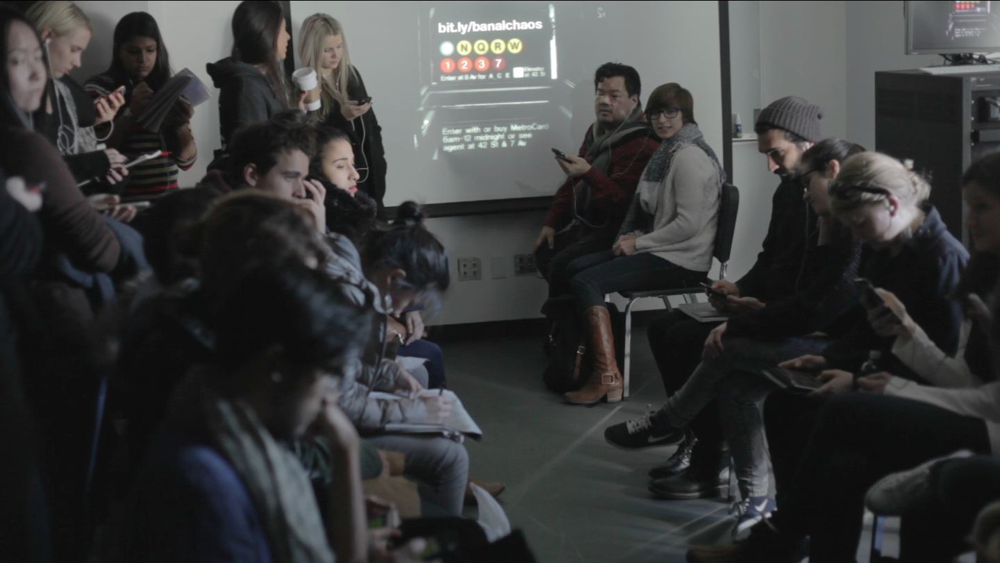
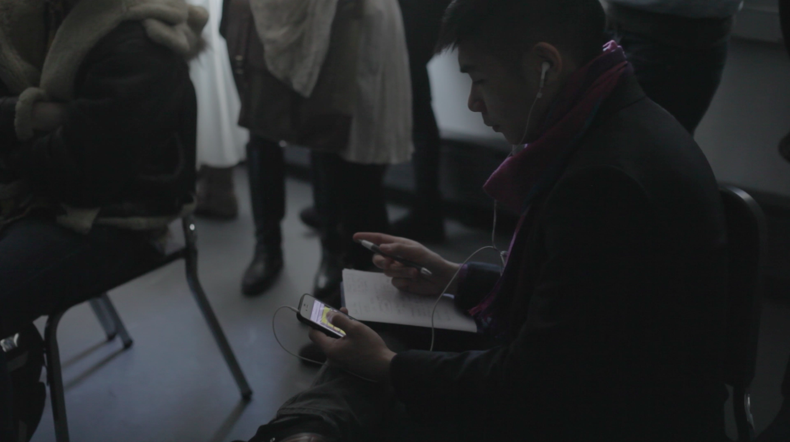
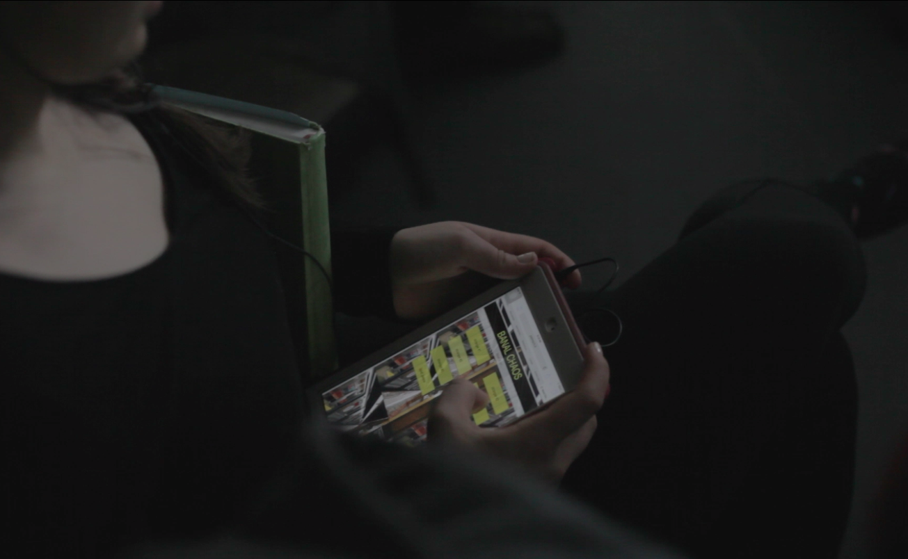
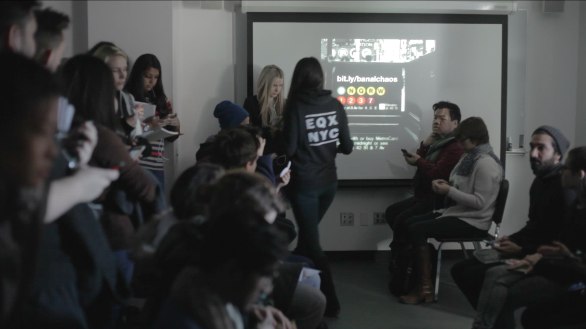
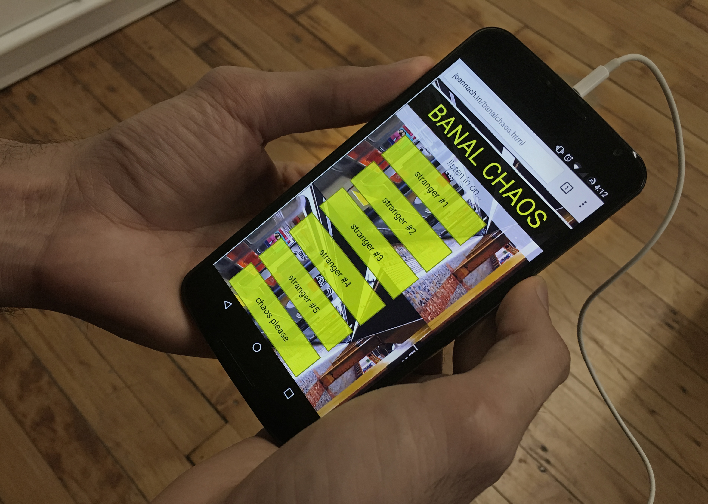

<i>Banal Chaos</i> is an interactive performance piece in which audience members sit as if they are in an NYC subway car and don headphones in order to listen in on the conversations and inner thoughts of strangers, while performers silently act out those strangers' daily transit routines. The piece explores how a performance experience can be both shared and individual and how the use of game mechanics and audience choice can create a more immersive, interactive, and connected physical-digital experience.

<h2 class="project-sub">Challenge</h2>

The prompt/problem for <i>Banal Chaos</i> was more about methodology, process, and implementation than product, business, or user concerns. As a performance/installation piece conceptualized and actualized within a 24-hour period of time, the team was forced to explore differences of cross-discipline creative process, unknown variables regarding presentation, and diverse expectations about the final outcome.

<h2 class="project-sub">Goal</h2>

Our team's goal was to create a performative response to the prompt, "banal chaos," that was flexible enough to work for a single large group performance or groups filtering in and out of the performance space. We wanted to use tech in a way that was supported and reflected the underlying themes of the piece in an essential rather than auxiliary way.

<h3 class="project-sub-main">Design Process</h3>

I worked with a group of five to develop the concept and create basic user flow. The team, which was comprised of one film artist, an actor, a director, a playwright, and myself, had to make a concerted effort to develop a way of working together that took aspects of both design and theatre creative process. We learned quickly that individuals had very different views on process and product and that establishing a common ground of practice was essential to moving forward. We did quick individual brainstorming sessions and shared concepts with one another, building off of each other's ideas and focusing on common themes.

We settled on developing a piece around conversations and sounds on the subway (which are banal amidst the chaos of public transportation in NYC). As the technical and interaction expert on the team, I suggested that we draw from shared experiences and common interactions on the subway.

<h2 class="project-sub">Performance</h2>

The final piece played with the everyday actions that we use in the subway - listening in on conversations, getting lost in internal thought, and putting on headphones - to explore and subvert those actions.

The audience brought their own mobile devices and headphones into the space and were invited to use them to access a web app through which they could listen to pre-recorded conversations and internal monologues from passengers. Audience members could choose "chaos" (to listen to all the conversations simultaneously) or to listen to one conversation at a time and switch between the characters; user choice was a crucial piece of the experience. The audio experience was grounded by subway sounds (recorded by one of my teammates) that played on speakers in the shared performance space.

Meanwhile, performers pantomimed the characters who are having the conversations/internal monologues. This created a situation in which audience members had to engage in order to connect what they were seeing with what they were listening to. In this way we created a piece that examines performance as a personalized experience and as a game (with audience members trying to guess which stranger’s conversation they were listening in on).

<h2 class="project-sub">Technical Development</h2>

With a quick turn-around time, I developed and deployed the mobile web app for the project. The app is built using HTML, CSS, javascript and contains pre-recorded audio components.

