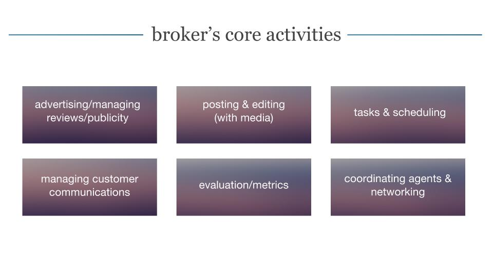
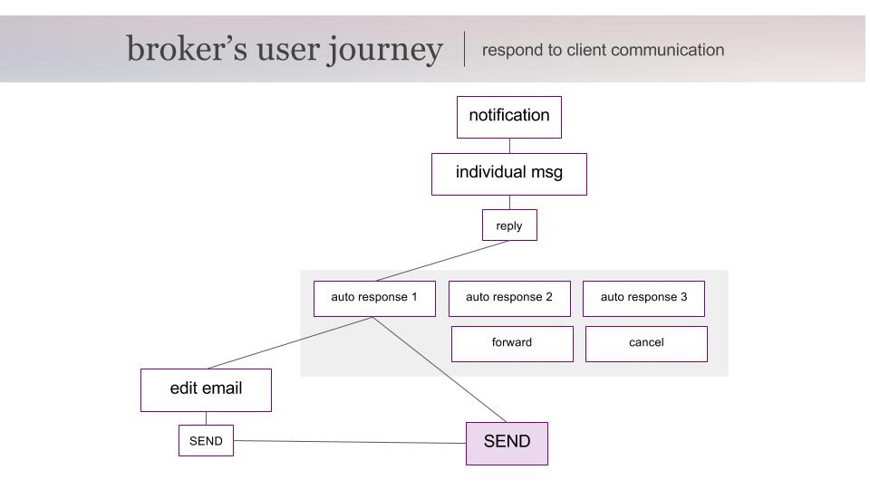
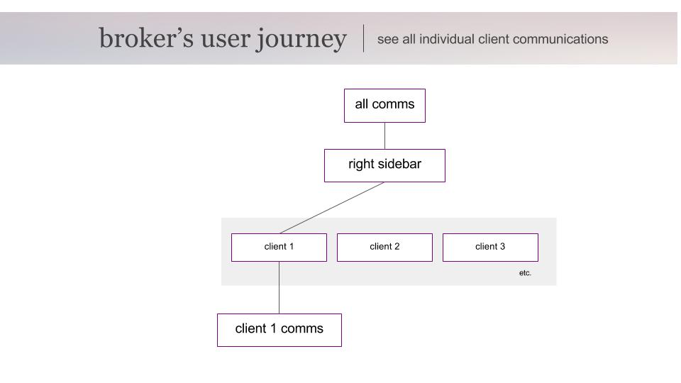
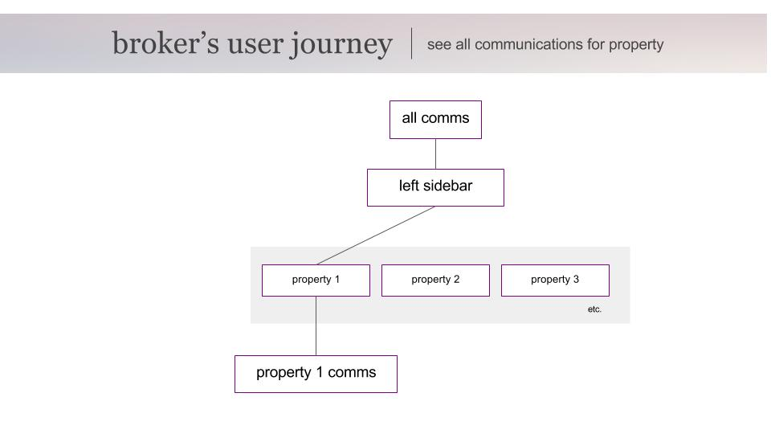
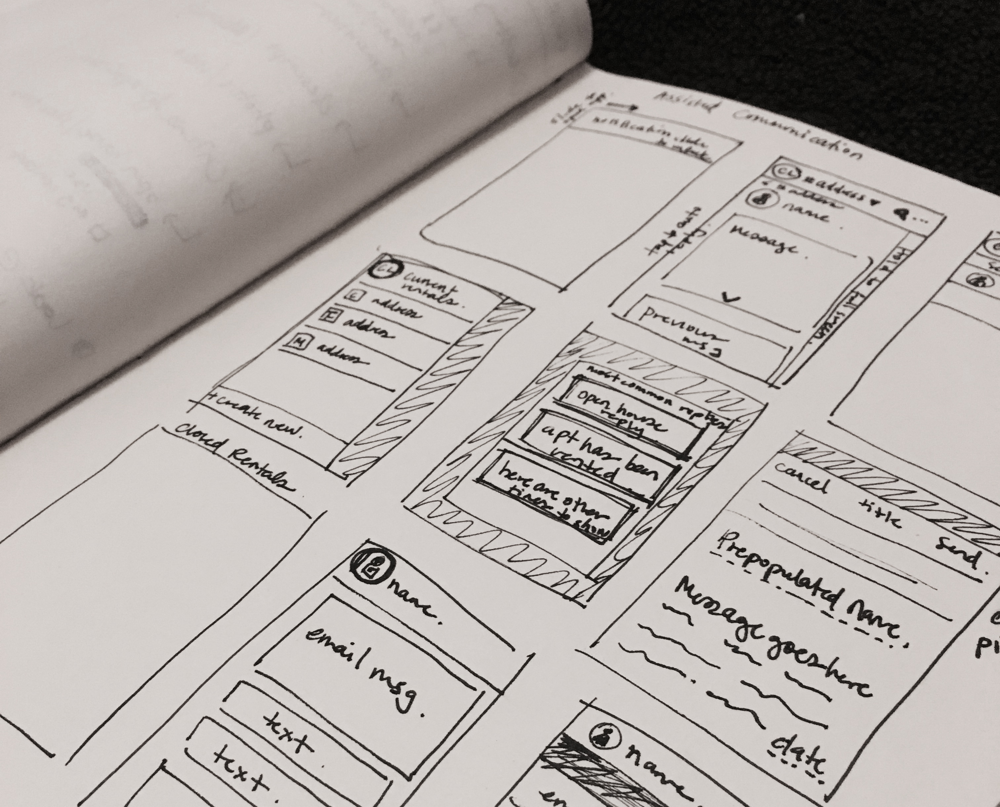
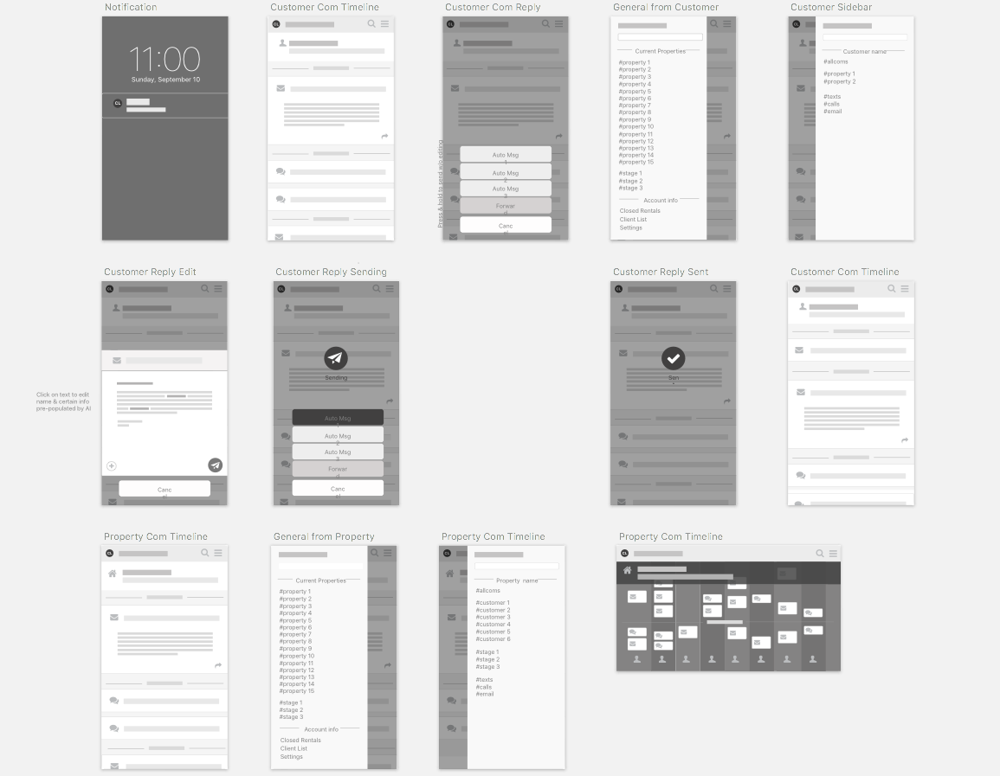
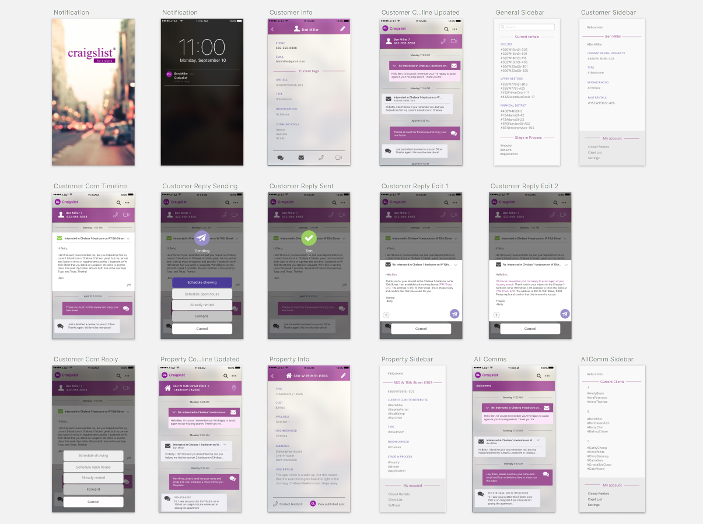

<i>Craigslist for Brokers</i> is a design concept for creating a real estate broker's companion application for rental postings on craigslist.

A complete competition analysis revealed that while there are companies out there with apps intended to help real estate brokers and their teams, ultimately many of these are hard to navigate, do not integrate with craigslist, and don't directly address the new challenges of multi-channel communication with clients that face brokers today.

In order to figure out the core activities for a young, somewhat tech-savvy real estate broker in Manhattan, where high-demand neighborhoods may produce 1,000+ responses per day, I spoke with several brokers and mapped out the entire retail process from acquiring & negotiating details of service and posting an ad to scheduling, final logistics, and follow-up. From these I pulled out six core activities:

Because some of these are needs are fulfilled already by craigslist or other competitor apps, I pulled out managing customer communications as one place with potential for more innovation in order to improve organization of clients and speed of response.

Mapping out a broker's possible journey through an app for specific tasks associated with client management showed me places where a user might want quick access to a specific client or property.

	
	
	

After observing and speaking with several brokers, I also noted that part of their challenge was the multitude of ways that a client could communicate with them - even just keeping track of emails, texts, and automated messages from real estate online posting sites was difficult. To deal with the volume of responses that often required automated or similar responses, I incorporated some simple AI to determine when an automated script could be selected for a response, while still giving the broker the ability to customize the message if need be. Boiled down, these needs became the core features for my app design.

In order to mockup the proposed application with these core features, I first sketched out general screen flows, created some quick digital wireframes, and designed the final user interface designs.

<i>Craigslist for Brokers</i> was created in response to a design challenge for Moment design studio.