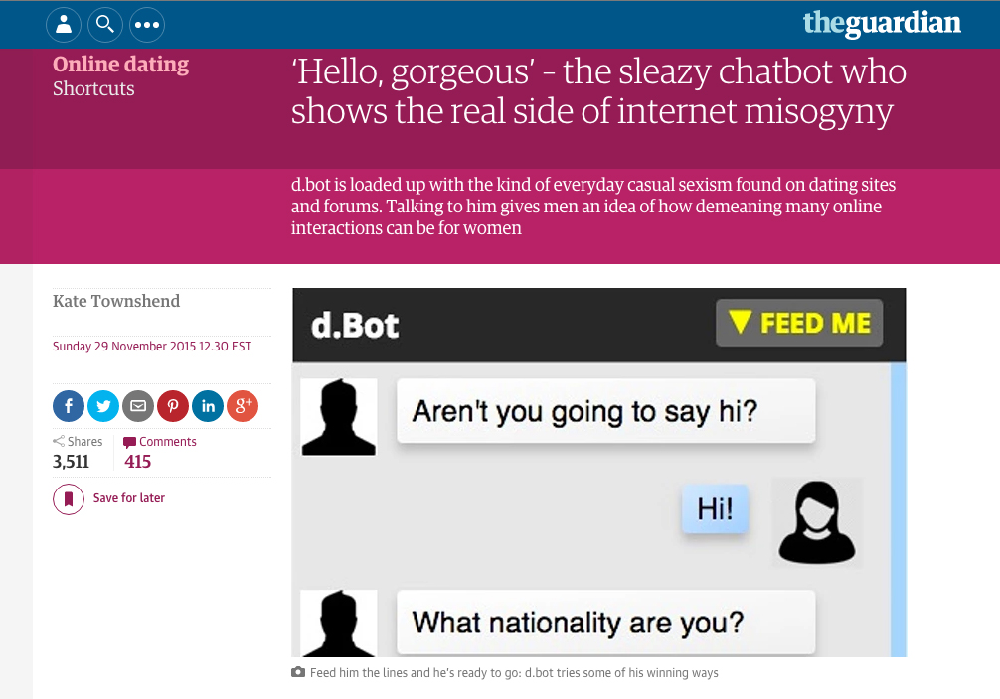
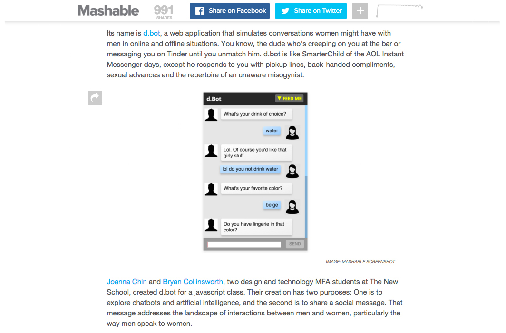

<i>D.bot</i> is a chatbot that draws from female experiences in dating to simulates conversing with an unenlightened male. The project is intended to address, in a light-hearted and humorous way, the pervasiveness of gender stereotypes and the ease with which disrespectful or patronizing comments find their way into everyday conversation. It was featured in <i>The Guardian</i>, <i>Mashable</i>, <i>Refinery29</i>, <i>MTV News</i>, and other feminist and/or tech blogs.

<h2 class="project-sub">Challenge</h2>

Women are harassed both in real life and online. We know this is a problem, but it was particularly evident when we were creating <i>d.bot</i> because of the numerous articles on street harassment published around that time and because a feminist dating site, Bumble, had just come onto the scene. Bumble sought to break traditional gender roles (of who pursues who) and create a "safer" space based on "online accountability and kindness." The traction it has gained since then seems to indicate the continuing desire for new solutions to the problem of harassment based on gender.

Rather than focus on lack of safe space, we saw one of the big challenges of gender-based harassment as understanding the relationship between the benign, well-intentioned gendered comments that many men make and the extremely chauvinistic and recognizably egregious ones. There is no easy way to say to a male colleague or friend that their casual sexist comments and actions are still perpetuating a culture that enables even more aggressively sexist and chauvanistic responses and behavior.

<h2 class="project-sub">Goal</h2>

From an interaction standpoint, the goal with d.bot was to create an experience in which the user continues to engage with something despite not wanting to. From a social change standpoint, we were interested in a creating a bot that was both comedic in its responses, but also ran the gamut of sexist and racist comments from more benign to outrageously insulting.

The final bot draws from a database of responses derived from women's actual interactions in online and offline dating. Users are encouraged to add their own experiences to the bot's AI, so that it can continue to reflect the latest in insensitive and ridiculously sexist comments.

<h2 class="project-sub">Learning</h2>

In addition to the technical learning of how to make a simple chatbot from scratch, <i>d.bot</i> was a fascinating exploration into some major aspects of how interaction design can be used to craft better, more intuitive artificial intelligence experiences.

<blockquote>"I knew it was a bot, and it still made me so mad!"
 -comment from anonymous user</blockquote>

The bot was built using "simple AI" (i.e., exact responses for specific trigger words rather than using algorithms to determine natural language patterns and learn from them). However, <i>d.bot</i> was a successful interactive experience because we used the context of the bot and users' conversations to our advantage.

Because he is positioned as a "douche bot," the user immediately excuses slightly off responses because, like a real jerk, he's not actually listening to you most of the time. Second, the content of the chat is similar to what you might experience on an online dating site, so it provides some context and direction for the conversation, because we know what kind of topics are discussed when you are trying to suss out another person's personality and intent.

While creating <i>d.bot</i> we were also really interested in the premise of the Turing Test, which is the measuring stick by which people qualify the humanness of a machine. It seems that the test assumes that best of what humanity is (reasoned and knowledgable), rather than our faults, which often make us unresponsive, rude, and illogical. <i>D.bot</i>, like Microsoft's infamous racist twitter bot, poses that these flaws actually make the bot experience more human.

Based on feedback from early users, we modified <i>d.bot</i> to include responses to users' actions as well as the content of their responses. For example, in the latest iteration, the bot will comment if a user takes too long to respond (e.g., "Are you ghosting me?") and also has some special responses if a user is too curt (repeated short responses) or too verbose (words larger than eight characters).

<i>D.bot</i> was created in collaboration with Bryan Collinsworth. I took the lead on the experience design, web development, and content curation. The bot was built using HTML/CSS, JavaScript, node.js, socket.io, and a Parse database.