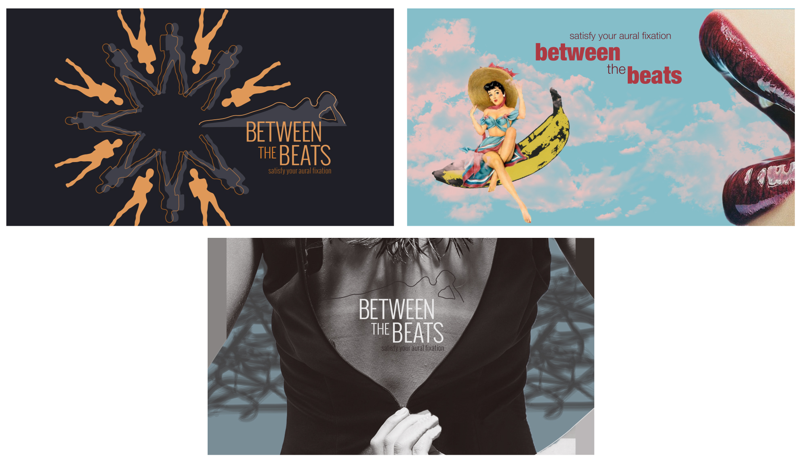
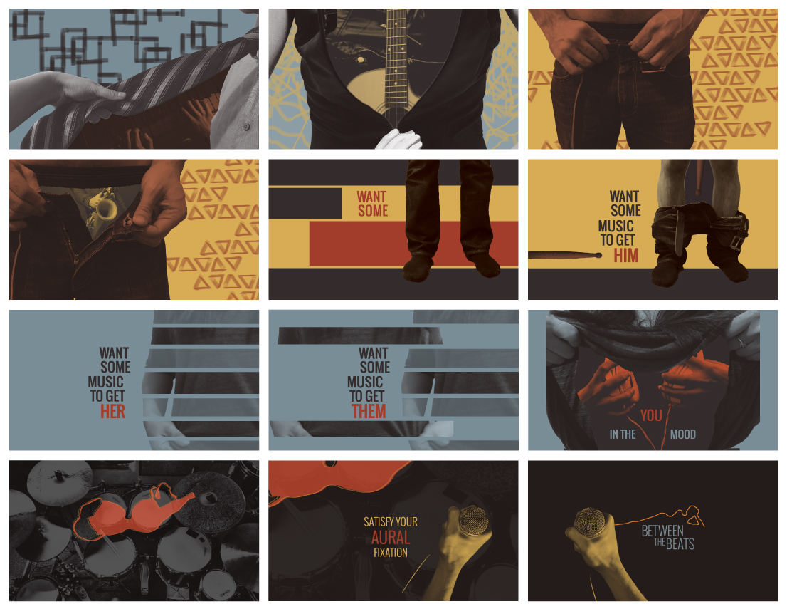

<i>Between the Beats</i> is a short motion graphics piece created for a fictional music channel that delivers "music to get you in the mood."

Starting with style frames, I established three distinct visual styles and vocabulary.

After deciding on an aesthetic direction based on user testing the readability of each of these designs, I created a storyboard to articulate and flesh out the visual style and start to encapsulate the motion and transition design as well. I drew from Blue Note records cover art as one major source of inspiration.

The final motion graphics piece was done in After Effects and pushes the idea of music hidden under clothing and in the spaces in between to highlight the unique edgy and irreverent personality of this sexy music channel.

This piece was shown as part of a projection piece at the Parsons Fashion Gala (2016).