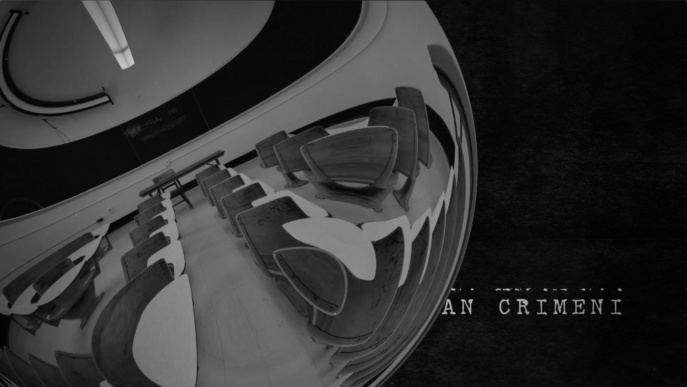

Brief opening credits for the play, <i>in a word</i> (by Lauren Yee) directed and performed by students in The New School drama department. Animations were hand-drawn and the motion design was done in After Effects.

