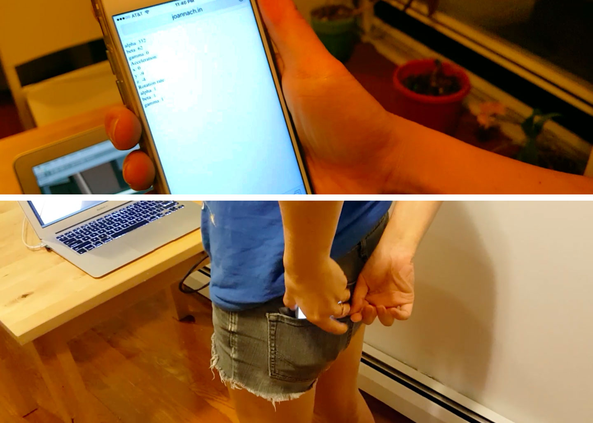
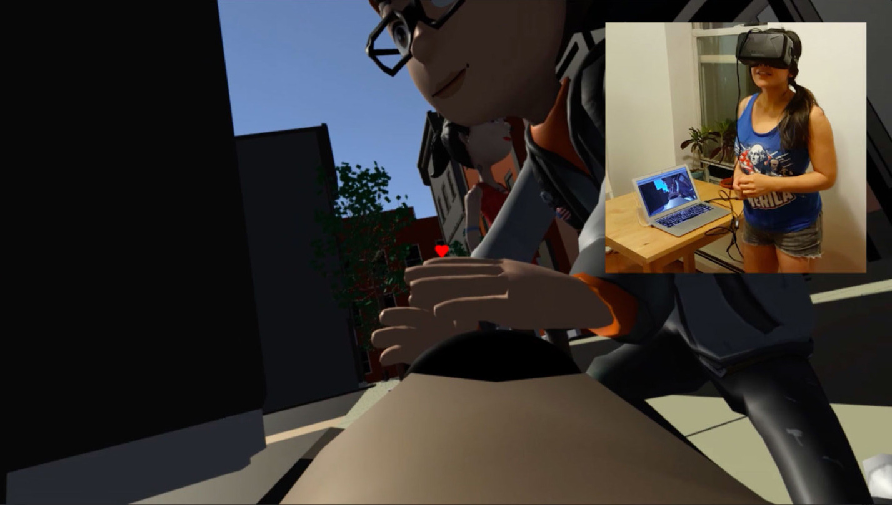

<i>Wag It</i> is a virtual reality game in which one plays a dog searching for love and attention by wagging her tail (i.e., shaking her butt). A player dons an Oculus Rift and uses a mobile device placed in her back pocket to measure wagging motion.

For inspiration, I drew from current critiques of VR, using the player's blindness/isolation in the headset as a way to provide entertainment not only for the primary user but also those around her. A related impetus for this project was the challenge of creating a scenario in which a person would willingly act a little bit ridiculous.

<i>Wag It</i> is built in Unity 5 and the game environment is connected to a web endpoint in order to continuously pull a mobile device's accelerometer data. The endpoint was built using JavaScript and node.js.

This game was developed as part of the 2016 Intel Kill Screen Scholars program.