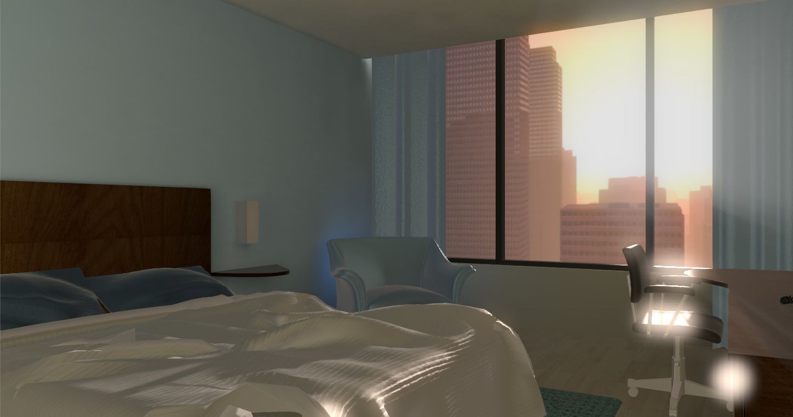
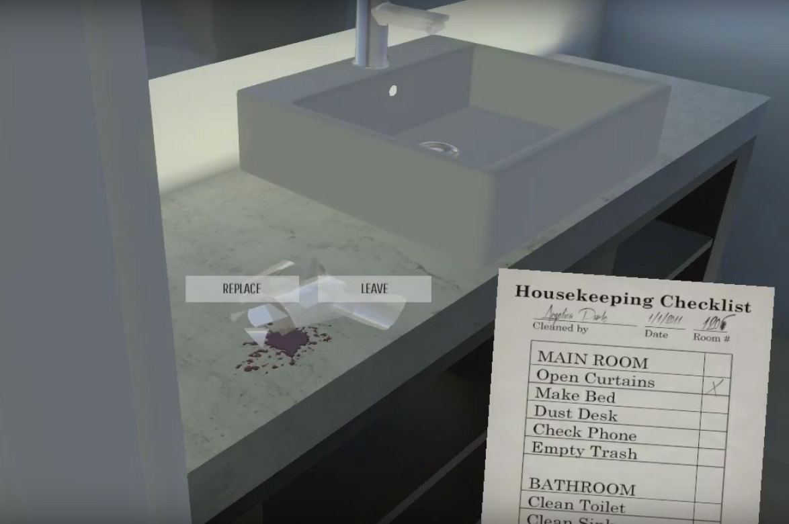
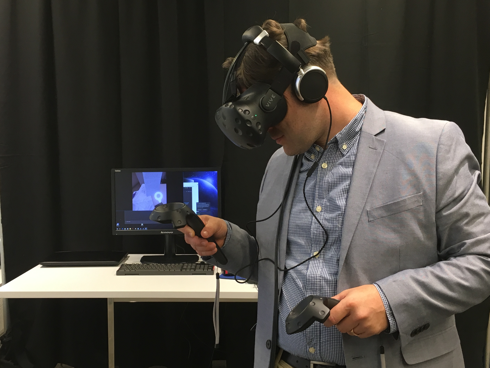

<i>Room 1206</i> is an exploratory narrative game in which players play a hotel housekeeper responsible for cleaning the same hotel room every day. As players complete their daily tasks, they encounter the signs and remnants of the guests who are staying there: personal items, photographs, and "garbage" left behind. Some items are mundane; some hint at secrets and scandals, the triumphs and failures of human life.

This game was created with an interest in creating tension between a desire to uncover narrative and the ethics required of a housekeeper. My collaborator and I wanted to understand how objects tell the story of their owners and play with the minutiae that emerge and become important in an otherwise consistent environment (the same hotel room) that requires repetitive actions from the player (cleaning the room).

The game is built in Unity in collaboration with Bryan Collinsworth. For this project, I built 3D models using Rhino and Maya and developed many of the player and object interactions. <i>Room 1206</i> was demoed at the NYC Arcade (2015).

Here's an example of an early asset and interaction test:

<iframe width="640" height="360" src="https://www.youtube.com/embed/mV5ck72Ubuk" frameborder="0" allowfullscreen></iframe>

Later my teammate built on this narrative premise to create a VR experience using Unreal Engine and HTC Vive during a fellowship with Viacom. It was showcased at a Viacom Next Demo Day (August 2016).

For this iteration, the player is not necessarily the housekeeper; the player's role in the game/narrative remains ambiguous throughout. The experience focuses on the immersive quality of the virtual reality platform, as well as the compelling narrative told through the items left behind rather than the ethical quandaries of digging through someone's personal items.

<iframe width="640" height="360" src="https://www.youtube.com/embed/86cJoypqFew" frameborder="0" allowfullscreen></iframe>

