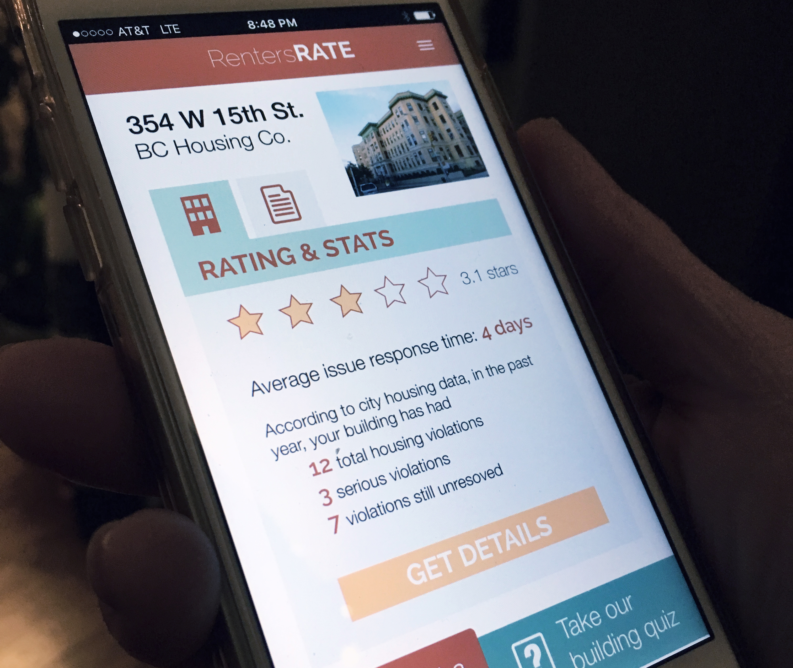
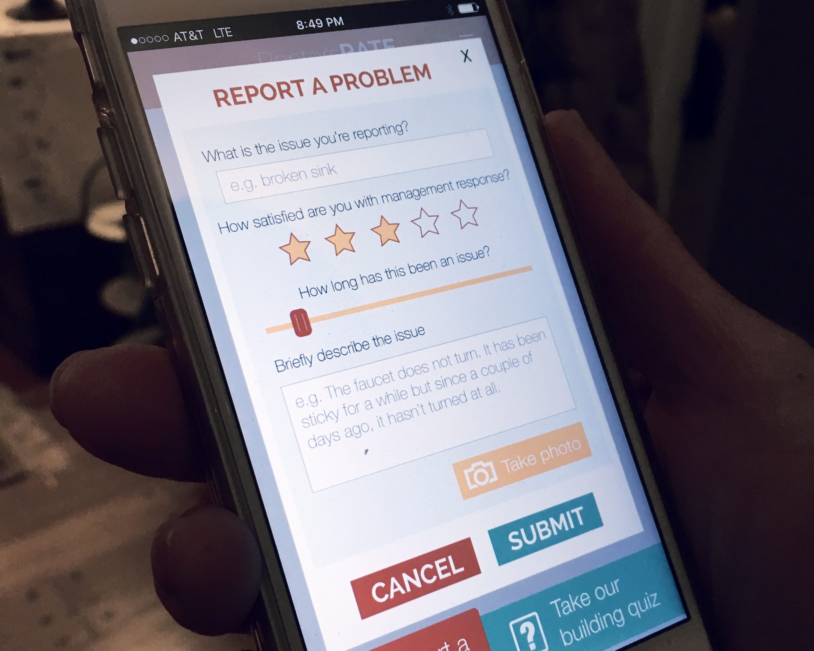

RentersRATE is an app and SMS system that crowdsources tenant feedback for safer and healthier living. The app allows NYC tenants to submit reports about problems in their building or apartment in order to hold landlords and building management companies more accountable.

<h2 class="project-sub">Challenge</h2>

Half of NYC's residents are renters, including many of the city's most economically insecure people. Unsafe and unhealthy living conditions are shockingly common: in 2014, NYC’s 200 worst buildings had over 4,300 immediately hazardous violations, according to the Department of Housing Preservation and Development. Limited city enforcement resources and huge landlord-tenant power differentials leave many renters with few effective ways to expose and address issues like faulty utilities, infestations, crumbling infrastructure or financial exploitation that can put their health, wellbeing and livelihood at risk. Tenants often don’t even know if fellow residents are experiencing similar issues. In an era of enormous income inequality, it’s crucial to empower renters to report serious problems and build communities and networks of accountability to get them addressed.

<h2 class="project-sub">Goal</h2>

My collaborator and I were developing rentersRATE for the 2015 New Challenge, a competition to fund ideas that address today's social and environmental challenges. We had about 3 months to conduct our entire design process, pitch our product concept, and go through two rounds of feedback and iteration. Judging was based on innovation of solution, team qualifications, partnerships with relevant people/groups working in the space, and likelihood of implementation and social impact. With RentersRATE we were focused on creating a platform that would empower tenants, hold landlords and housing management companies accountable, and provide a place for NYC government workers to check and flag problems or see big housing trends.

<h3 class="project-sub-main">Product Design Process</h3>

Our process for developing RentersRATE involved four major stages: research, ideation, prototyping, feedback and iteration. Particularly because our goal was to provide a platform that empowered NYC tenants, we were particularly cognizant of centering our design process and product around our users' needs and familiar digital interactions.

<h2 class="project-sub">Research & Ideation</h2>

In the research stage of the project, we spoke with NYC renters and housing rights activists in order to better understand the problem and existing solutions. We found that current systems are largely limited to city housing authorities relying on inspections and enforcement within tough budget constraints; tenant advocacy organizations doing strong work but lacking a substantial digital footprint, and web platforms like Zillow that focus more on owners than renters. The city has NYC311, which allows residents to submit complaint and check its status either online or through an app, but ultimately, this still puts the onus on muncipal entities to follow through.

We developed RentersRATE to fill this niche for a digital product that enables tenants to take direct action using technologies they already have (SMS, web, and app-enabled mobile phones). We were particularly influenced by the lack of connectedness and solidarity as barriers to renters' rights, and drew from other successful social feedback models (e.g. Yelp for dining, TripAdvisor for travel, Amazon reviews for products) in order to bring this crowdsourced feedback model to housing.

<h2 class="project-sub">Prototyping</h2>

My primary role in prototyping was developing the UX/UI design and testing the user flow with an InVision. Because of the interest in making this product accessible to a wide range of NYC tenant populations, I spent time mapping out the user experience beyond the screen, including how a user with a flip-phone might use SMS for reporting. Two of the biggest challenges in designing this user experience were balancing anonymity versus information sharing and how to simplify the user journey as much as possible while still achieving the app's primary goals. In scoping the project, we made a conscious choice to focus primarily on fleshing out tenants' interactions (while keeping the landlords' and government workers' purpose for accessing the app as part of the larger framing).

<h2 class="project-sub">Feedback & Iteration</h2>

The first iteration of the concept was publish on the New Challenge website and the general public was invited to give their input, while the selection committee gave specific feedback on the viability of the concept and proposed implementation from our application. As a result of these comments, my collaborator and I revised both our framing of the idea, and reached out to additional housing policy and advocacy experts. As a result of feedback from all of these sources, we did a second iteration of the prototype, which included a page after a user reported a problem that pulled up specific action items that they could take right now - from a government webpage to find out more about the specific policy around their complaint to municipal departments to call directly.